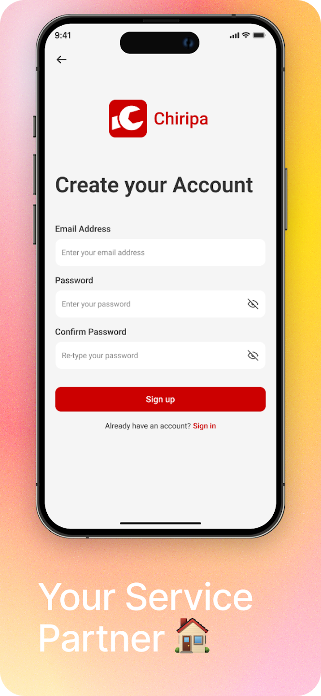
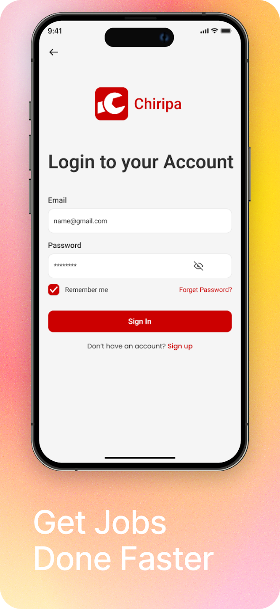
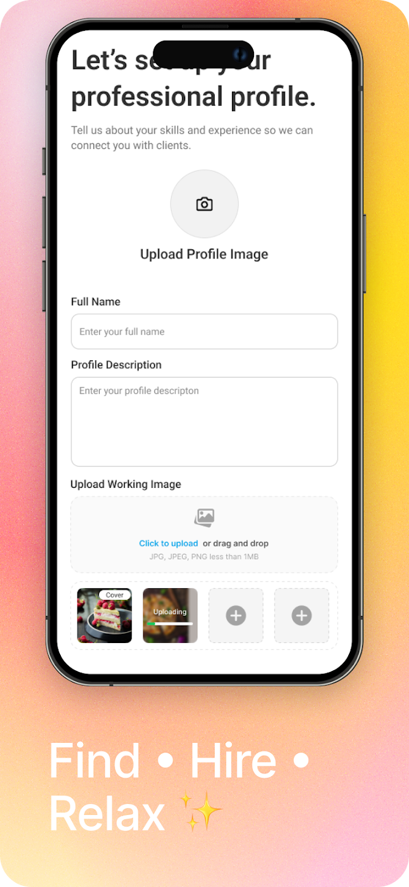
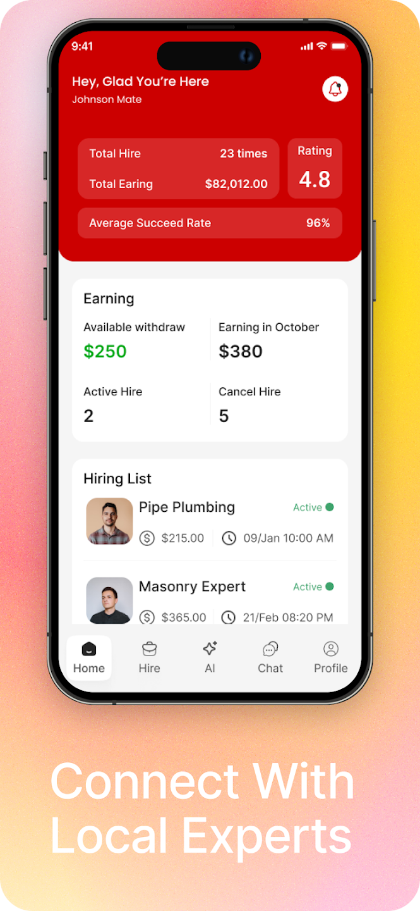

# RealTime Service Marketplace Backend

[](https://play.google.com/store/apps/details?id=com.service_connect)

## App Screenshots

<p align="center">
  
  
  
  
</p>

Production-oriented Django backend for a service marketplace platform, built with a modular app architecture, real-time messaging, and payment-ready workflows.

## Why This Project Stands Out

- Designed as a **multi-domain backend** with clear app boundaries (`authapp`, `quoteapp`, `messageapp`, `notificationapp`, etc.)
- Supports **role-based marketplace behavior** (service receivers and service providers)
- Includes **real-time chat infrastructure** (Django Channels + ASGI routing)
- Covers **quote/order lifecycle flows** with cancellation and payment status handling
- Prepared for **background processing** and asynchronous tasks
- Structured for maintainability with serializers, app-level URLs, and migrations across domains

## Backend Highlights

### 1. Modular Domain Architecture
The codebase is split into focused Django apps, each owning a business area:

- `authapp` -> authentication, user-related flows, signals, utility logic
- `serviceproviderapp` -> provider profiles, documents, financial/bank details
- `servicereceiverapp` -> receiver-side domain models and APIs
- `quoteapp` -> quotation and order lifecycle, payment/cancellation metadata
- `messageapp` -> conversation/message models, serializers, REST endpoints, websocket consumer/routing
- `notificationapp` -> notification domain

This structure improves team scalability and reduces coupling between features.

### 2. API-First Design
Across apps, each module follows DRF-friendly patterns:

- `models.py` for domain entities
- `serializers.py` for request/response shaping and validation
- `views.py` + `urls.py` for endpoint orchestration
- isolated `tests.py` placeholders for domain-level testing

### 3. Real-Time Communication
The backend includes websocket-ready components:

- ASGI entrypoint (`myproject/asgi.py`)
- channel consumer and websocket routing in `messageapp`

This enables low-latency messaging features typically expected in modern marketplace products.

### 4. Payment & Order State Readiness
From migration history and quote domain files, the backend includes support for:

- quotation and order records
- cancellation request/status workflows
- payment status tracking
- templates for payment-related UX integration (`quoteapp/templates/payment.html`)

### 5. Media/File Handling
The repository contains organized media directories for:

- profile images
- category images
- provider work uploads
- message files/images

This suggests practical handling of user-generated content in production-like scenarios.

## Tech Stack

- **Python**
- **Django**
- **Django REST Framework**
- **Django Channels / ASGI**
- **SQLite/PostgreSQL-compatible Django ORM workflow** (depends on environment settings)

## Repository Structure (Backend Core)

```text
myproject/               # Django project settings, ASGI/WSGI, global URLs
authapp/                 # Authentication and user-domain logic
serviceproviderapp/      # Provider profiles, docs, financial details
servicereceiverapp/      # Receiver-side domain
quoteapp/                # Quotes, orders, payments, related APIs
messageapp/              # Messaging models, APIs, websocket consumers
notificationapp/         # Notification domain
manage.py                # Django management entrypoint
requirements.txt         # Python dependencies
```

## Getting Started

### 1. Clone and enter project

```bash
git clone <your-repo-url>
cd chiripa_backend
```

### 2. Create and activate virtual environment

Windows PowerShell:

```powershell
python -m venv .venv
.\.venv\Scripts\Activate.ps1
```

Git Bash:

```bash
python -m venv .venv
source .venv/Scripts/activate
```

### 3. Install dependencies

```bash
pip install -r requirements.txt
```

### 4. Apply migrations

```bash
python manage.py migrate
```

### 5. Run backend server

```bash
python manage.py runserver
```

### 6. (Optional) Run ASGI server for websocket flows

```bash
daphne myproject.asgi:application
```

## Engineering Quality Signals for Recruiters

- Clear domain separation and scalable app boundaries
- Event and async readiness (`signals.py`, `tasks.py`, websocket consumers)
- Complex stateful workflows (quotes, orders, cancellation, payment statuses)
- Practical media and messaging handling for marketplace use-cases
- Migration trail that reflects iterative, real-product evolution

## Suggested Next Improvements

- Expand automated test coverage in each app
- Add OpenAPI/Swagger documentation for all endpoints
- Add CI pipeline (lint + tests + migration checks)
- Add environment-based settings split (dev/staging/prod)

---

## Author Note

This backend demonstrates production-style Django engineering with modular architecture, API-centric design, and real-time communication support, making it a strong showcase project for backend-focused roles.
